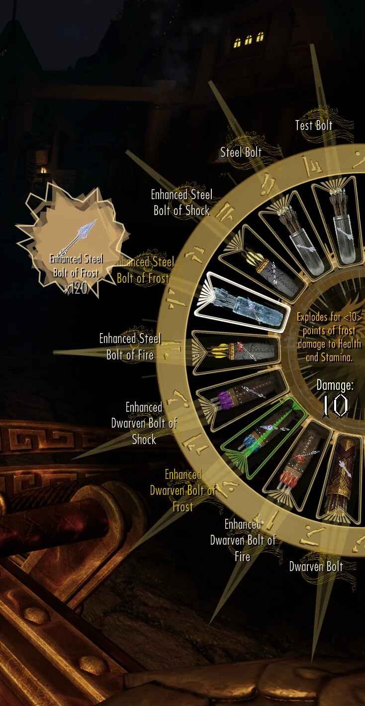

# Wheeler Refined

<p align="center">
  
</p>

<p align="center">
  A stability and feature overhaul of dTry/D7ry's radial quick-action menu for Skyrim Special Edition and Anniversary Edition.
</p>

<p align="center">
  <a href="https://www.nexusmods.com/skyrimspecialedition/mods/167380"></a>
  <a href="https://github.com/c0kadam/Wheeler-Refined/tags"></a>
  <a href="#building-from-source"></a>
  <a href="https://github.com/c0kadam/Wheeler-Refined/issues"></a>
  <a href="LICENSE"></a>
</p>

> [!IMPORTANT]
> End-user downloads and installation support are provided through the [Wheeler Refined Nexus page](https://www.nexusmods.com/skyrimspecialedition/mods/167380). A GitHub source checkout is not a complete player installation.

## What is Wheeler Refined?

Wheeler Refined modernizes [Wheeler](https://github.com/D7ry/wheeler), the quick-action wheel created by dTry/D7ry. It keeps Wheeler's core interaction and original assets while improving stability, controller behavior, configuration, feedback, and supported actions.

This is an independent derivative project. It is not an official continuation and is not affiliated with or endorsed by dTry/D7ry. Original Wheeler attribution and licensing are preserved throughout the repository.

## Highlights

| Area | Refined experience |
| --- | --- |
| Stability | Safer inventory and action snapshots, same-form weapon restoration, transformed-state handling, and input behavior. |
| Main Wheel | Configurable wheels, slots, direct actions, hand indicators, Release to Use, and save-specific persistence. |
| Controller and mouse input | Configurable Favorites and Quick Favorites workflows, controller and mouse paths, input pass-through, and dMenu-driven behavior. |
| Ammo Wheel | A separate inventory-driven wheel for arrows and bolts with layouts, sorting, low-ammo feedback, reskin support, and optional poison information. |
| Transform Wheel | Managed wheels for Werewolf, Vampire Lord, configured Lich forms, and configured generic transformations, with Lich safeguards. |
| Direct actions | Configurable direct actions and Release to Use provide deliberate activation paths. |
| Readable feedback | Hand state, activation progress, selected ammo, low-ammo feedback, and optional poison presentation. |
| Expanded item support | Ingredient items and configured Favorites and Quick Favorites workflows alongside the core wheel item types. |
| dMenu configuration | Update-safe factory defaults and in-game control of behavior, layouts, sorting, indicators, and appearance. |
| Integrations | Optional dMenu NG, Inventory Injector, OStim, Action Hotkeys Bridge, and External Wheeler API support. |

## Integration overview

Integrations extend Wheeler Refined when their companion mod or API is present; none is required for core wheel interaction.

| Integration | Type/default | Purpose | Configuration/documentation |
| --- | --- | --- | --- |
| I4 / Inventory Injector | Optional runtime integration; enabled in factory defaults | Uses Inventory Injector metadata and rendering for richer item icons, labels, and colors while retaining Wheeler fallbacks. | [I4.defaults.ini](Data/SKSE/Plugins/wheeler/I4.defaults.ini) |
| Action Hotkeys Bridge | Optional runtime integration; disabled | Mirrors configured Action Hotkeys slots into managed Wheeler wheels and supports native API hotkeys. | [ActionHotkeysBridge.defaults.ini](Data/SKSE/Plugins/wheeler/ActionHotkeysBridge.defaults.ini) · [API sample](tools/action_hotkeys_bridge_api_sample/README.md) |
| OStim | Optional runtime integration; disabled | Adds a configurable scene-control wheel with navigation, position browsing, previews, and restoration behavior. | [OStimIntegration.defaults.ini](Data/SKSE/Plugins/wheeler/OStimIntegration.defaults.ini) |
| External Wheeler API | Developer API; available after Wheeler initializes | Lets SKSE plugins manage transient wheels, entries, form items, external hotkeys, and supported callbacks. | [API overview](docs/API_INTEGRATION_SUMMARY.md) · [Logging reference](docs/API_LOGGING_REFERENCE.md) |

## Screenshots

### Main Wheel scaling


### Ammo Wheel


### dMenu customization


### Low-ammo feedback


## Installation

Use the [Wheeler Refined Nexus page](https://www.nexusmods.com/skyrimspecialedition/mods/167380) as the authoritative download and installation guide.

### Required

- [SKSE](https://skse.silverlock.org/) for the Skyrim runtime you use.
- [Address Library for SKSE Plugins](https://www.nexusmods.com/skyrimspecialedition/mods/32444), matching that runtime.
- [Wheeler - Quick Action Wheel of Skyrim](https://www.nexusmods.com/skyrimspecialedition/mods/97345). Wheeler Refined relies on the original package and assets for normal runtime installation.
- The current release of [dMenu NG](https://www.nexusmods.com/skyrimspecialedition/mods/166751).
- Wheeler Refined.

### Recommended or conditional

- [Dragonborn Reskin - Wheeler](https://www.nexusmods.com/skyrimspecialedition/mods/100043) is an optional visual reskin recommended by the author and used while many improvements were developed.
- Install [Skyrim Souls and Wheeler Slow Time Fix](https://www.nexusmods.com/skyrimspecialedition/mods/174828) when using Skyrim Souls.
- [Typing Mode](https://www.nexusmods.com/skyrimspecialedition/mods/164851) can help when text input conflicts with other menus.
- [Ammo Wheel Reskin SHULDOVAH - Wheeler Refined](https://www.nexusmods.com/skyrimspecialedition/mods/176631) is a concept visual reskin for Wheeler Refined's Ammo Wheel.

#### Ammo Wheel Reskin SHULDOVAH preview



### Normal mod-manager order

1. Install original Wheeler.
2. Install dMenu NG.
3. Install Wheeler Refined after both and allow it to overwrite where appropriate.
4. Install optional visual reskins last so their assets win conflicts.

Open dMenu in game to configure Wheeler Behaviour, Ammo Wheel, controls, styles, and optional integrations.

## Core Wheeler Concepts

Wheeler uses a compact hierarchy:

```text
Wheels -> Wheel -> Slot -> Item
```

You can move among multiple wheels, place multiple slots on each wheel, and cycle several items within a slot.


Open Wheeler while browsing the inventory or magic menu to enter edit mode. From there you can create and reorder wheels or slots, insert the highlighted item, and remove entries. During normal play, use a slot to equip, consume, or activate its current item.


Wheel state is stored per save in the SKSE co-save, including the identity needed to distinguish differently enchanted, poisoned, or tempered instances.

## Configuration and Compatibility

- **Skyrim:** Wheeler Refined 1.3.4 supports Skyrim 1.7.99 and 1.7.104 through CommonLibSSE-NG 6.7 and Address Library v5. Install the Address Library data matching your runtime.
- **dMenu:** Most behavior, control, layout, sorting, indicator, and appearance options are exposed in game. Factory/default INIs are update-safe; dMenu maintains user overrides.
- **Ammo Wheel:** Provides configurable layouts, filters, sorting, reskin support, low-ammo feedback, and optional ranged-weapon poison information in Center Fields.
- **Fonts and glyphs:** Configure `Data/SKSE/Plugins/wheeler/resources/fonts/FontConfig.ini` and supply a compatible font in the corresponding language folder when needed. This source tree does not claim to bundle all language fonts.
- **Input:** Controller and mouse/keyboard paths are supported. Heavily customized control maps or menu mods can still conflict; see [Input Compatibility](docs/INPUT_COMPATIBILITY.md).

## Transform Wheel

Transform Wheel behavior is configurable in `Data/SKSE/Plugins/wheeler/wheelBehavior.ini`; releases ship `wheelBehavior.factory.ini` as the factory source. Wheeler can manage transformed-state wheels for Werewolf, Vampire Lord, configured Lich forms, and configured generic transformations.

The current transform behavior includes form-specific ability discovery and filtering, safer transformed-state activation rules, configurable race and form matching, and restoration of the previous human wheel after a transform ends. Lich settings include optional staff and direct-cast safeguards for supported Undeath configurations.

## Integrations

### I4 / Inventory Injector

I4 support is enabled in the factory defaults but remains runtime-optional: it activates only when Inventory Injector and its Scaleform interface are available. Inventory Injector is not required for core Wheeler behavior. When it cannot resolve an icon, Wheeler continues with its normal icon pipeline. Review [I4.defaults.ini](Data/SKSE/Plugins/wheeler/I4.defaults.ini) for category and extraction settings.

### OStim

OStim integration is runtime-optional and disabled by default. When explicitly enabled and available, Wheeler creates a managed scene-control wheel with configurable navigation, position browsing, previews, scene actions, and restoration behavior. See [OStimIntegration.defaults.ini](Data/SKSE/Plugins/wheeler/OStimIntegration.defaults.ini).

### Action Hotkeys Bridge

The Action Hotkeys Bridge is optional and disabled by default. It can mirror configured Action Hotkeys slots into managed Wheeler wheels and supports external hotkeys supplied through the native bridge API. See [ActionHotkeysBridge.defaults.ini](Data/SKSE/Plugins/wheeler/ActionHotkeysBridge.defaults.ini) and the [API sample](tools/action_hotkeys_bridge_api_sample/README.md).

### External Wheeler API

The External Wheeler API is a developer capability, not a player dependency. After Wheeler initializes, an SKSE plugin can manage transient wheels, entries, form items, external hotkeys, and supported event callbacks. Managed wheels are deliberately excluded from save serialization and must be recreated by their owner. Start with the [API integration summary](docs/API_INTEGRATION_SUMMARY.md).

## Building from Source

The project requires a C++23 Windows toolchain, CMake 3.22 or newer, vcpkg, and CommonLibSSE-NG 6.7.0 at commit `3d81614617910e7f34b33d8750881811b5e36445`.

```powershell
cmake --preset vs2022-windows -B build-public `
  -DCOPY_OUTPUT=OFF `
  -DCommonLibSSEPath_NG='C:\src\CommonLibSSE-NG'

cmake --build build-public --config Release --target wheeler
```

The DLL is produced at `build-public/src/Release/wheeler.dll`. See the [build requirements above](#building-from-source) for setup and no-deployment build guidance.

## Developer Documentation

- [Build from source](#building-from-source)
- [Contributing](CONTRIBUTING.md)
- [API integration summary](docs/API_INTEGRATION_SUMMARY.md)
- [API logging reference](docs/API_LOGGING_REFERENCE.md)
- [Input compatibility](docs/INPUT_COMPATIBILITY.md)
- [Ammo Wheel reskin manual](docs/Reskin_Manual_AmmoWheel.md)
- [Action Hotkeys bridge API sample](tools/action_hotkeys_bridge_api_sample/README.md)
- [Wheeler Preview Tool](tools/wheeler_preview/README.md)

## License and Attribution

Wheeler Refined is distributed as a combined work under [GPL-3.0-only](LICENSE).

It is a modified derivative of [Wheeler](https://github.com/D7ry/wheeler) by dTry/D7ry. Original Wheeler source remains under the [BSD 3-Clause License](LICENSES/BSD-3-Clause-Wheeler.txt), copyright © 2024 dTry. The GPL selection for Wheeler Refined does not relicense the original project or other third-party components.

See [NOTICE.md](NOTICE.md) and [THIRD_PARTY_NOTICES.md](THIRD_PARTY_NOTICES.md) for provenance, credits, and third-party terms.
