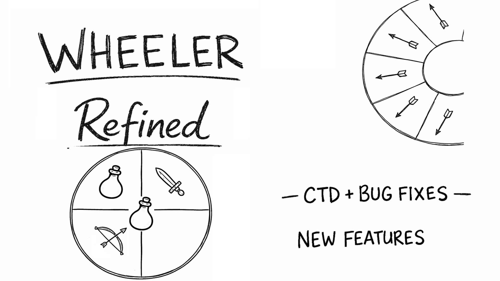
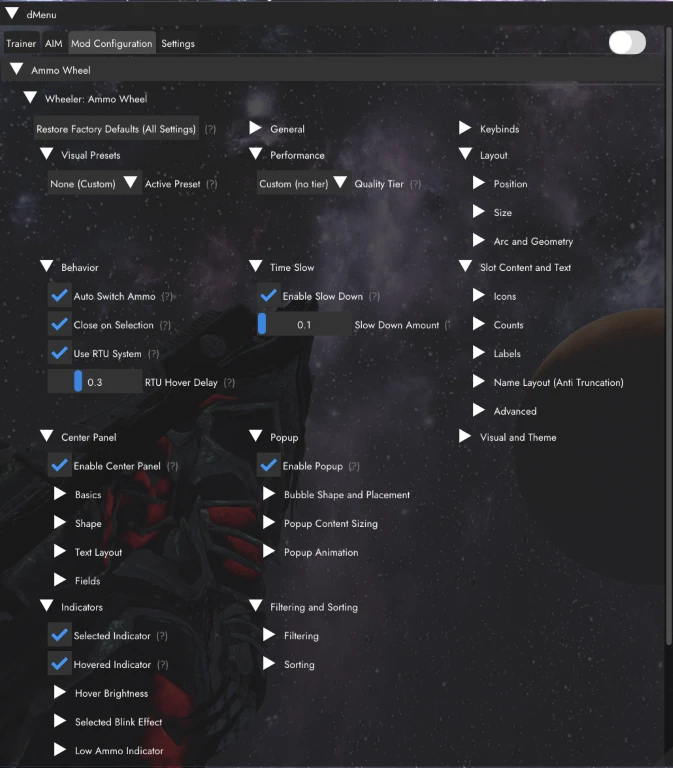

# Wheeler Refined

<p align="center">
  
</p>

<p align="center">
  A stability and feature overhaul of dTry/D7ry's radial quick-action menu for Skyrim Special Edition and Anniversary Edition.
</p>

<p align="center">
  <a href="https://www.nexusmods.com/skyrimspecialedition/mods/167380"></a>
  <a href="https://github.com/c0kadam/Wheeler-Refined/releases/latest"></a>
  <a href="BUILDING.md"></a>
  <a href="https://github.com/c0kadam/Wheeler-Refined/issues"></a>
  <a href="LICENSE"></a>
</p>

> [!IMPORTANT]
> End-user downloads and installation support are provided through [Nexus Mods](https://www.nexusmods.com/skyrimspecialedition/mods/167380). A GitHub source checkout is not a complete player installation.

## What is Wheeler Refined?

Wheeler Refined modernizes [Wheeler](https://github.com/D7ry/wheeler), the quick-action wheel created by dTry/D7ry. It keeps Wheeler's core interaction and original assets while overhauling stability, controller behavior, configuration, feedback, and supported actions.

This is an independent derivative project. It is not an official continuation and is not affiliated with or endorsed by dTry/D7ry. Original Wheeler attribution and licensing are preserved throughout the repository.

## Highlights

| Area | Refined experience |
| --- | --- |
| Stability | Broad fixes for long-standing crashes, quick-load problems, stale slots, weapon persistence, and input edge cases. |
| Controller and mouse input | More stable stick selection, center-rest snapping, safer edit-mode input blocking, smoother Ammo Wheel mouse hover, and configurable modifier/toggle behavior. |
| Ammo Wheel | A separate inventory-driven wheel for arrows and bolts, with configurable layouts, filtering, sorting, Release to Use, low-ammo feedback, and reskin support. |
| Direct actions | Optional Direct Casting and Direct Shouts reduce equipment churn while retaining configurable timing, cancellation, and feedback. |
| Readable feedback | Left/right-hand state, activation progress, shout stages and cooldowns, casting state, selected ammo, and low-ammo indicators. |
| Expanded item support | Improved handling for renamed and enchanted equipment, scripted miscellaneous items, throwables, books, instruments, transformation skills, and other mod-added actions. |
| Adaptive presentation | Global scaling, automatic screen-bound scaling, configurable wheel geometry, slot text fitting, and resolution-aware layouts. |
| dMenu configuration | In-game controls for behavior, keybinds, layout, sorting, visuals, sounds, indicators, and optional features. |
| Performance | An Ammo Wheel performance mode replaces animated presentation with a simpler rendering path for lower-overhead use. |

### Integration overview

Integrations extend Wheeler Refined when their companion mod or API is present; none is required for core wheel interaction.

| Integration | Type and factory default | Purpose | Configuration or documentation |
| --- | --- | --- | --- |
| I4 / Inventory Injector | Optional runtime integration; enabled, but inactive without Inventory Injector | Uses Inventory Injector metadata and rendering to provide richer item icons, labels, and colors. | [I4.defaults.ini](Data/SKSE/Plugins/wheeler/I4.defaults.ini) |
| Action Hotkeys Bridge | Optional runtime integration; disabled | Imports Action Hotkeys slots into managed Wheeler wheels and supports hotkeys supplied through the native bridge API. | [ActionHotkeysBridge.defaults.ini](Data/SKSE/Plugins/wheeler/ActionHotkeysBridge.defaults.ini) · [API sample](tools/action_hotkeys_bridge_api_sample/README.md) |
| OStim | Optional runtime integration; disabled | Adds an OStim scene-control wheel with optional position browsing and previews when a compatible OStim installation is detected. | [OStimIntegration.defaults.ini](Data/SKSE/Plugins/wheeler/OStimIntegration.defaults.ini) |
| External Wheeler API | Developer API; available after Wheeler initializes | Lets SKSE plugins manage transient wheels, entries, form items, external hotkeys, and supported event callbacks. | [API overview](docs/API_INTEGRATION_SUMMARY.md) · [Logging reference](docs/API_LOGGING_REFERENCE.md) |

## Screenshots

### Main Wheel scaling


### Ammo Wheel


### dMenu customization



### Low-ammo indicator


## Installation

Use the [Wheeler Refined Nexus page](https://www.nexusmods.com/skyrimspecialedition/mods/167380) as the authoritative download and installation guide.

### Required

- [SKSE](https://skse.silverlock.org/) for the Skyrim runtime you use.
- [Address Library for SKSE Plugins](https://www.nexusmods.com/skyrimspecialedition/mods/32444).
- [Wheeler - Quick Action Wheel of Skyrim](https://www.nexusmods.com/skyrimspecialedition/mods/97345). Wheeler Refined currently relies on the original package and assets for a normal runtime installation.
- The current release of [dMenu NG](https://www.nexusmods.com/skyrimspecialedition/mods/166751). Refined's settings expect its current interface.
- [Wheeler Refined](https://www.nexusmods.com/skyrimspecialedition/mods/167380).

### Recommended or conditional

- [Dragonborn Reskin - Wheeler](https://www.nexusmods.com/skyrimspecialedition/mods/100043) is strongly recommended by the author and was used while many improvements were developed.
- Install [Skyrim Souls and Wheeler Slow Time Fix](https://www.nexusmods.com/skyrimspecialedition/mods/174828) when using Skyrim Souls.
- [Typing Mode](https://www.nexusmods.com/skyrimspecialedition/mods/164851) can help when text input conflicts with other menus.

### Normal mod-manager order

1. Install original Wheeler.
2. Install dMenu NG.
3. Install Wheeler Refined after both and allow it to overwrite where appropriate.
4. Install optional visual reskins last so their assets win conflicts.

Open dMenu in game to configure **Wheeler Behaviour**, **Ammo Wheel**, controls, styles, and optional integrations.

## Core Wheeler Concepts

Wheeler uses a compact hierarchy:

```text
Wheels -> Wheel -> Slot -> Item
```

You can move among multiple wheels, place multiple slots on each wheel, and cycle several items within a slot.


Open Wheeler while browsing the inventory or magic menu to enter edit mode. From there you can create and reorder wheels or slots, insert the highlighted item, and remove entries. During normal play, use a slot to equip, consume, or activate its current item.


Wheel state is stored per save in the SKSE co-save, including the identity needed to distinguish differently enchanted, poisoned, or tempered instances.

## Configuration and Compatibility

- **dMenu:** Most behavior, control, layout, sorting, indicator, and appearance options are exposed in game. Factory/default INIs remain the update-safe source; dMenu creates and maintains live user overrides.
- **Performance mode:** Available in the Ammo Wheel settings. It replaces animated presentation with a simpler rendering path for lower-overhead use.
- **Reskins:** Main Wheel and Ammo Wheel assets can be replaced. Install reskins after Refined and keep the supplied defaults as fallbacks. See the [Ammo Wheel reskin manual](docs/Reskin_Manual_AmmoWheel.md).
- **Fonts and glyphs:** Configure `Data/SKSE/Plugins/wheeler/resources/fonts/FontConfig.ini` and supply a compatible font in the corresponding language folder when the bundled source assets do not cover your glyphs.
- **Input:** Controller and mouse/keyboard paths are both supported, but heavily customized control maps or menu mods can still conflict. See [Input Compatibility](docs/INPUT_COMPATIBILITY.md).
- **Optional integrations:** Integrations activate only when their companion mod or API is available and configured. Review the relevant settings and logs before reporting a compatibility issue.

Compatibility depends on each load order, input setup, UI stack, and game runtime. Please report reproducible combinations rather than assuming universal compatibility.

## Integrations

### Action Hotkeys Bridge

The Action Hotkeys Bridge is for users of Action Hotkeys and for SKSE plugins that supply external hotkeys. It is **disabled by default**. When enabled with automatic injection, Wheeler Refined reads `Data\SKSE\Plugins\ActionHotkeys.ini` and the dedicated `Data\SKSE\Plugins\ActionSlots.ini` slot file, falling back to slot data in `ActionHotkeys.ini` when necessary. Automatic refresh watches those source files and rebuilds the managed bridge wheels after changes.

Factory settings create two bridge wheels, with per-wheel capacity and jump keys available for up to eight. Jumping to a bridge wheel remembers the previous user wheel so the same control can return to it. Source-tagged placement is retained in `ActionHotkeysBridge.layout.ini`; conflicting Wheeler hotkeys are blocked by default, and secondary activation mirrors primary activation by default. Override these settings in `ActionHotkeysBridge.ini`; see [ActionHotkeysBridge.defaults.ini](Data/SKSE/Plugins/wheeler/ActionHotkeysBridge.defaults.ini).

Plugins can also upsert, remove, or clear external hotkeys through the native bridge API. API-injected entries are transient and should be recreated by their owner, while stable source tags allow the bridge layout to retain their positions. The [Action Hotkeys bridge API sample](tools/action_hotkeys_bridge_api_sample/README.md) demonstrates the supported workflow.

### I4 / Inventory Injector

I4 support is **enabled in the factory defaults but remains runtime-optional**: it activates only when Inventory Injector and its Scaleform `ProcessEntry` interface are available. Inventory Injector is not a dependency for core Wheeler behavior. With `PreferI4Icons` enabled, Wheeler passes item metadata through Inventory Injector and uses the returned icon source, label, and color. Built-in icon handling and off-screen extraction are enabled by default. The enabled alternative path also permits I4 attempts for non-inventory spell, shout, and power entries when their category controls allow it. If I4 is unavailable or cannot produce an image, Wheeler keeps its normal fallback icon.

The `UseFor*` switches determine which categories may use I4. Factory defaults enable inventory categories and shouts, with spells and powers disabled. The separate `ExtractFor*` switches enable capture for weapons, armor, ammo, books, scrolls, lights, miscellaneous items, shouts, and powers; food, ingredients, potions, poisons, and spells are disabled. An extraction switch does not bypass its category's `UseFor*` switch. Review and override [I4.defaults.ini](Data/SKSE/Plugins/wheeler/I4.defaults.ini) to match your UI setup.

### OStim

OStim integration is runtime-optional and **disabled by default**. `AutoDetect` probes for a compatible installation, but does not enable the integration on its own. When explicitly enabled and available, Wheeler Refined creates a managed scene-control wheel and removes it when the scene ends. Automatic switching to that wheel is off by default; restoration of the previously selected wheel after the scene is on.

Position browsing, valid-position filtering, names, and previews are enabled by default. Preview resolution prefers OStim scene metadata and then Wheeler's resource mappings; browsing prefers the current animation class and displays up to six positions per page by default. All actions remain guarded by the detected scene state and API availability. See [OStimIntegration.defaults.ini](Data/SKSE/Plugins/wheeler/OStimIntegration.defaults.ini) for the full set of controls.

### External Wheeler API

The External Wheeler API is a developer capability, not a player dependency. After confirming that Wheeler has initialized, another SKSE plugin can query Wheeler status; create and delete managed wheels; inspect or select wheels; add and remove entries; inject, remove, inspect, and select items by FormID; and manage external hotkeys. Implemented notifications cover item activation and wheel open/close state.

Managed wheels are deliberately excluded from save serialization. Their owning plugin must recreate them and manage their lifecycle on each session. Start with the [API integration summary](docs/API_INTEGRATION_SUMMARY.md), use the [API logging reference](docs/API_LOGGING_REFERENCE.md) when diagnosing calls, and see the [Action Hotkeys bridge API sample](tools/action_hotkeys_bridge_api_sample/README.md) for a buildable client example.

## Building from Source

The project requires a C++23 Windows toolchain, CMake 3.22 or newer, vcpkg, and the pinned CommonLibSSE-NG revision. With `VCPKG_ROOT` set and CommonLib checked out:

```powershell
cmake --preset vs2022-windows -B build-public `
  -DCOPY_OUTPUT=OFF `
  -DCommonLibSSEPath_NG='C:\src\CommonLibSSE-NG'

cmake --build build-public --config Release --target wheeler
```

The DLL is produced at `build-public/src/Release/wheeler.dll`. See [BUILDING.md](BUILDING.md) for the exact pinned revisions, a from-zero Windows setup, deployment builds, and the optional API sample.

> [!WARNING]
> Building `wheeler.dll` alone is not necessarily a complete end-user installation. Wheeler Refined currently depends on the original Wheeler package/assets for normal runtime installation; use the Nexus packages and installation order above for play.

## Developer Documentation

- [Build guide](BUILDING.md)
- [API integration summary](docs/API_INTEGRATION_SUMMARY.md)
- [API logging reference](docs/API_LOGGING_REFERENCE.md)
- [Input compatibility](docs/INPUT_COMPATIBILITY.md)
- [Ammo Wheel reskin manual](docs/Reskin_Manual_AmmoWheel.md)
- [Action Hotkeys bridge API sample](tools/action_hotkeys_bridge_api_sample/README.md)
- [Wheeler preview tool](tools/wheeler_preview/README.md)

Contributions are welcome through [issues](https://github.com/c0kadam/Wheeler-Refined/issues) and pull requests. Please read [CONTRIBUTING.md](CONTRIBUTING.md) before submitting code or assets.

## License and Attribution

Wheeler Refined is distributed as a combined work under [GPL-3.0-only](LICENSE).

It is a modified derivative of [Wheeler](https://github.com/D7ry/wheeler) by dTry/D7ry. Original Wheeler source remains under the [BSD 3-Clause License](LICENSES/BSD-3-Clause-Wheeler.txt), copyright © 2024 dTry. The GPL selection for Wheeler Refined does not relicense the original project or other third-party components.

See [NOTICE.md](NOTICE.md) and [THIRD_PARTY_NOTICES.md](THIRD_PARTY_NOTICES.md) for provenance, credits, and third-party terms.
